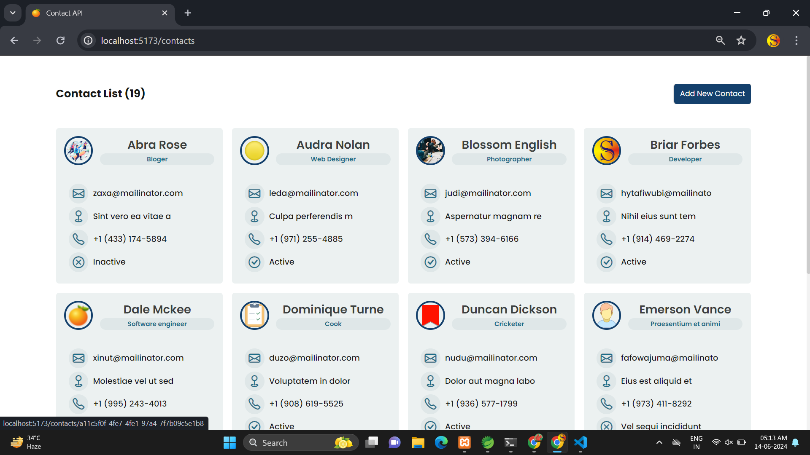
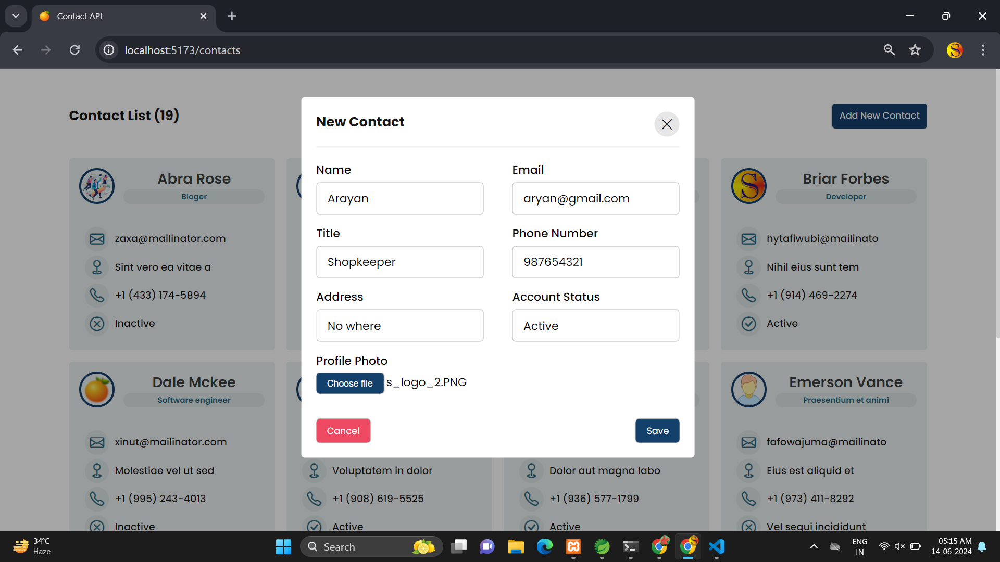
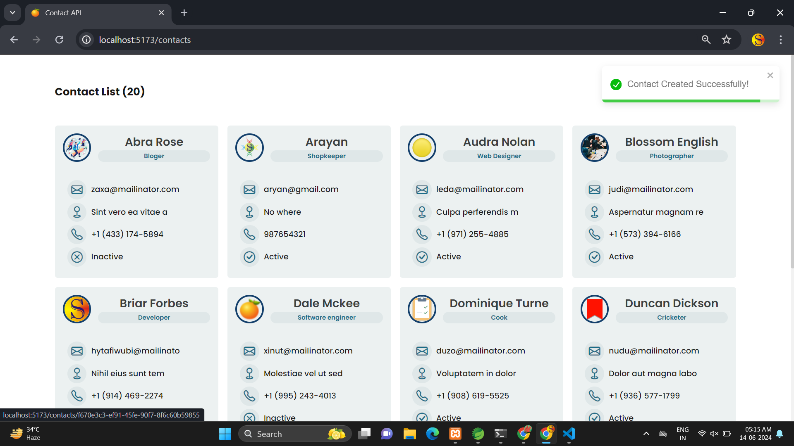
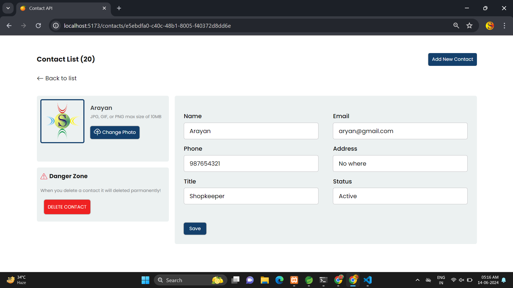
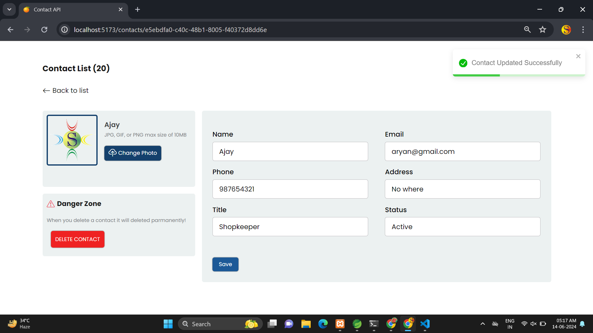

# contacts-manager
It is an contact manager to manage our contacts. Created using spring boot on backend and react js on frontend.
 
## Technologies used
   1. Java
   2. Spring boot
   3. MySQL database
   4. React Js
   5. Editors : VS code & Spring tool suite 4

## Screenshots

<div style="display: flex;flex-direction: column; grid-gap: 10px;">
    <div style="display: flex; grid-gap: 10px;">
        
        
    </div>
    <div style="display: flex; grid-gap: 10px;">
        
        
    </div>
      <div style="display: flex; grid-gap: 10px;">
        
    </div>
</div>
<br>

## How to use ?
  As mentioned the project has two parts and both run on different server

### Run backend code
    
 <b>Step-1 :</b> Open your project in spring tool suite 4 IDE <br>
   <b>file->import->maven->existing maven project-> click on next -> locate the folder [ContactApi backend] -> click to finish</b>
   <br><br>
   NOTE: make sure your internet connection is on because maven download jar's required for project to be build.

 <b>Step-2 :</b> Create an MySQL database with the name 'contact_api'.<br>
  You can change the database related settings - If you want the path of file to change settings is : <b> ContactApi backend\src\main\resources\application.yml</b><br><br>
   You can create your database by using mysql workbench 

```sql
CREATE DATABASE `contact_api`;
```
   <br>
      
 <b>Step-3 :</b> Run your application <br>
   <b>right click on your project name -> Run As -> Spring boot App</b>
   <br><br>
   If you don't see any errors that means you are good to go. The backend is started and tomcat is running the port 8080
    <br><br>
   Note: Make sure to do not turn of your backend otherwise your frontend will not work.

### Run frontend code
 Make sure you have node js installed on your machine 


 <b>Step-1 :</b> Locate the folder 'contactapp frontend' using your terminal or command prompt.<br>
   
   install neccessery libraries 

```sh
npm i react-router-dom
```
```sh
npm i react-toastify
```
After the completion of these two you are ready to run the application : to run this type : 
```sh
npm run dev
```
Visit the url appear on your terminal : In my case this is <i>[http://localhost:5173/contacts]</i>

   <br>
   
## Contributing

Pull requests are welcome. For major changes, please open an issue first
to discuss what you would like to change.

Please make sure to update tests as appropriate.
